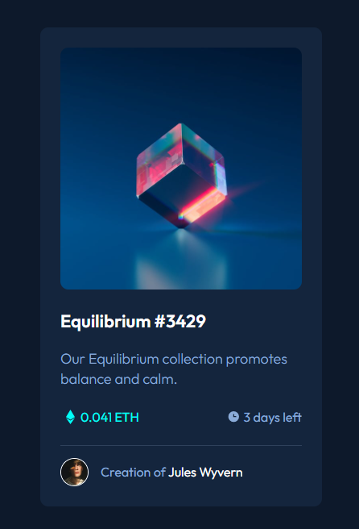
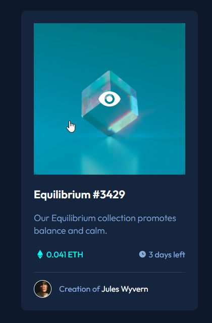

# Frontend Mentor - Solução de componente do cartão de visualização NFT

Esta é uma solução para o [desafio do componente do cartão de visualização NFT](https://www.frontendmentor.io/challenges/nft-preview-card-component-SbdUL_w0U/hub). Os desafios do Frontend Mentor ajudam você a melhorar suas habilidades de codificação criando projetos realistas.

## Índice

- [Visão geral](#visão-geral)
   - [O desafio](#o-desafio)
   - [Captura de tela](#captura-de-tela)
   - [Links](#links)
- [Meu processo](#meu-processo)
   - [Construído com](#construído-com)
   - [O que aprendi](#o-que-aprendi)
- [Autor](#autor)

## Visão geral

### O desafio

- Descrição da tarefa: Você deve criar um layout próximo desse desafio do frontend mentor: [Frontend Mentor | NFT preview card component](https://www.frontendmentor.io/challenges/nft-preview-card-component-SbdUL_w0U/hub). Onde o principal desafio é construir um cartão de visualização de NFT. Nessa primeira etapa do exercício, será realizado a construção do HTML e CSS.

### Captura de tela

<div align="center">





</div>

### Links

- URL da solução: [https://github.com/Maicaoxd/cartao-de-nft](https://github.com/Maicaoxd/cartao-de-nft)
- URL do site ao vivo: [https://maicaoxd.github.io/cartao-de-nft/](https://maicaoxd.github.io/cartao-de-nft/)

### Como clonar projeto

1 - Clone para o projeto

```
git clone https://github.com/Maicaoxd/cartao-de-nft.git
```

2 - Acesse a pasta do projeto

```
cd app-gerador-de-conselhos
```
## Meu processo

### Construído com

- Marcação HTML5 semântica
- Propriedades personalizadas CSS3
- Flexbox
- Responsividade

## Autor

- GitHub - [Maicon Alves Guedes](https://github.com/Maicaoxd)
- Frontend Mentor - [@Maicaoxd](https://www.frontendmentor.io/profile/Maicaoxd)
